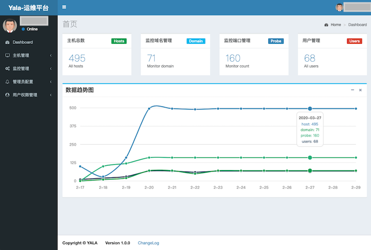
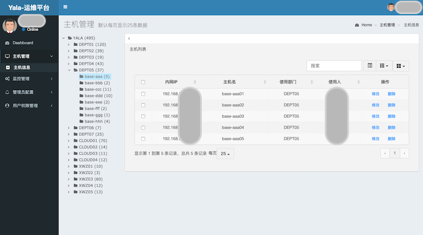
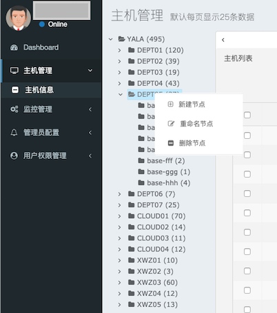
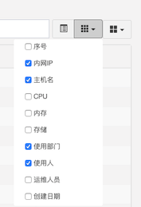
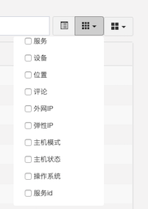
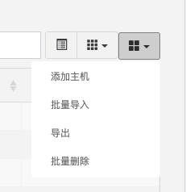
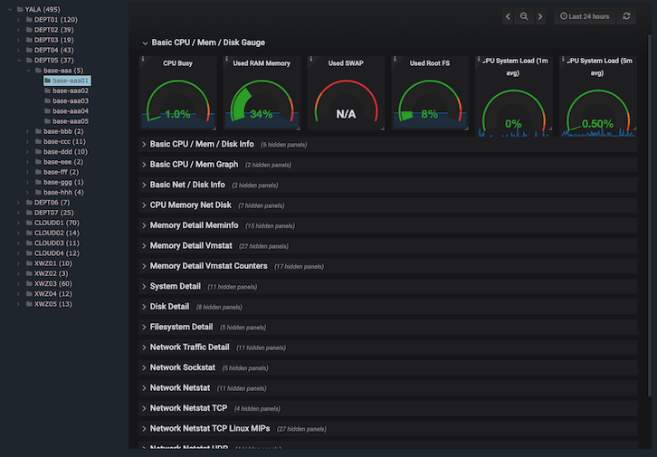
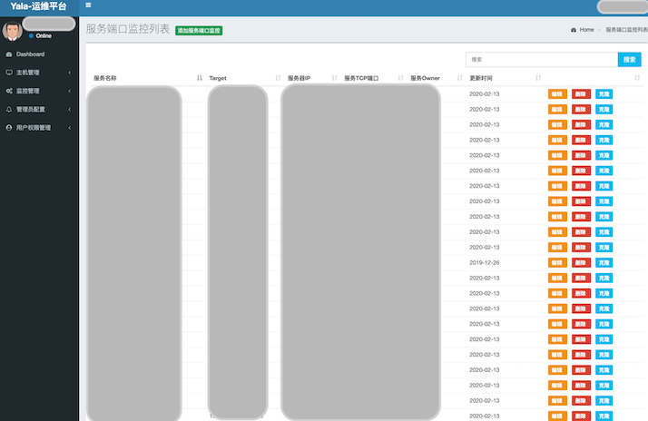
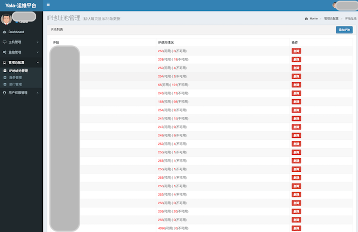

# Yala

Yala是该项目的代号。  
> Yala是斯里兰卡Yala National Park，自然风景很美，有丰富的野生动物。

Yala是综合的运维管理平台，使用GNU GPL v2.0开源协议。集成的功能有CMDB、监控域名和端口管理、阿里云主机管理等（v1.0.0版本去掉了阿里云主机管理等功能）。

## 开发语言和框架使用
 * 编程语言：Python3.7
 * 前端Web框架：Bootstrap + jquery + vue.js + AdminLTE2.0
 * 后端Web框架：Flask
 * 数据存储：MySQL 5.7

## 运行环境
在以下环境已长时间稳定运行  
Python 3.7 + CentOS 7.4 + MySQL 5.7

## 依赖模块
Python3的虚拟环境使用pipenv管理，具体可查看Pipfile文件

## 启动脚本
```
cd $Project_basedir
bash startup.sh start
```

## 项目介绍文档

### Dashboard

Dashboard主要是总揽和数据趋势，还需要进一步完善。


### CMDB

**备注：所有的部门、服务、主机信息都是我构造的，不是在生产环境实际使用的**

功能列表
- 以树型结构方式管理所有部门、服务、主机，包含每个节点下所有的主机数
    - 一级节点为公司名称
    - 二级节点为部门
    - 三级节点为服务
- 支持树型结构中树节点的增、删、改、查、鼠标拖动等
- 支持主机的信息增、删、改、查
- 支持批量导入和导出主机信息
- 支持批量删除主机
- 支持自定义显示列
- 支持搜索
- 提供鉴权的API接口用于外部调用

**CMDB页面截图**  


**树型结构管理**  


**自定义显示列**  
  

**支持批量导入**  
    

**主机信息修改**  
  

**通过API获取树型信息和主机信息后呈现的监控**
 

<br>

---

<br>

### 监控管理

监控管理主要提供域名和端口的管理页面和API接口，可配合Prometheus等监控工具使用（也可使用Consul等进行服务的注册管理，看实际需求和便利性）

 


### 管理员配置

在管理员配置中提供了IP地址池、部门、服务的管理功能。

 


### 权限管理
目前的权限控制和管理实现不太规范，但可满足需求，暂不想去修改；待后续有需要的再进行修改。

当前角色分为四种，分别对应不同的权限：
- Admin 
- Ops
- RD
- AlyOps

## 贡献者  
除了我 [xl0shk](https://github.com/xl0shk) 以下同学也都有过贡献代码  
[seadog0331](https://github.com/seadog0331)  
[Avan1984](https://github.com/Avan1984)  
[zak0329](https://github.com/zak0329)  
